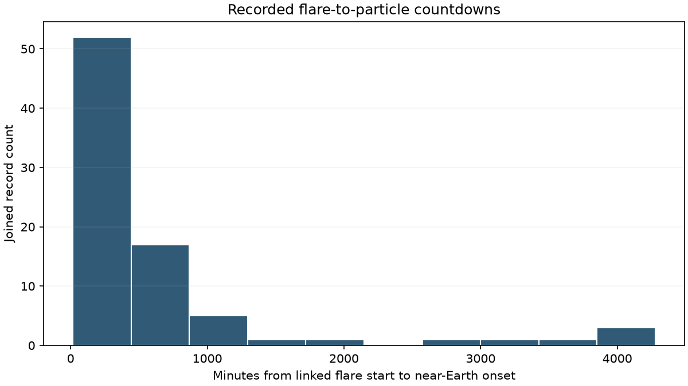
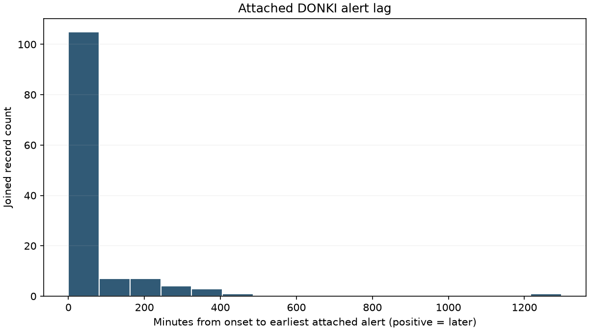
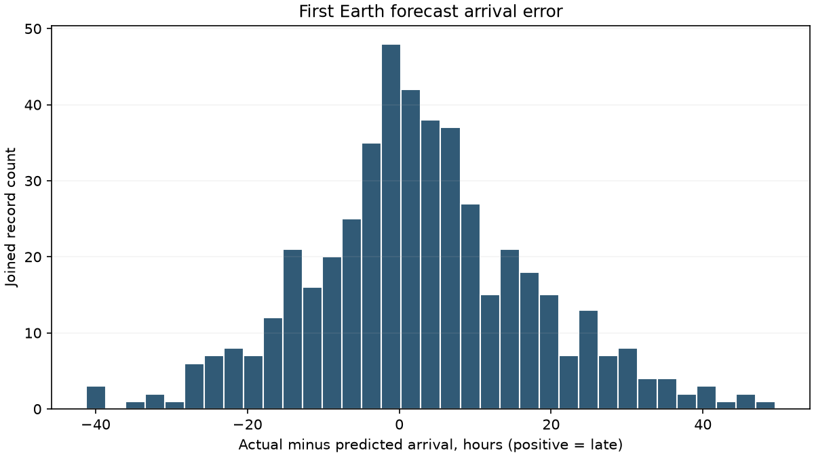

# NASA DONKI pipeline report

GO: 124 independent clean CME-arrival pairs (need 40); 77 clean countdowns (need 40); 74 playable windows (need 30).

Source: [https://ccmc.gsfc.nasa.gov/DONKI-API/get/](https://ccmc.gsfc.nasa.gov/DONKI-API/get/)

UTC query range: 2010-01-01 through 2026-10-08 inclusive. Fetch completed: 2026-10-08T14:48:56.367713+00:00.
All 1230 cached chunks have SHA-256 provenance. Raw cache remains ignored by Git.

## Counts

| Joined category | Full archive | Shipped playable subset |
| --- | ---: | ---: |
| flares | 3390 | 892 |
| sepEvents | 144 | 87 |
| cmeForecasts | 968 | 262 |
| surpriseArrivals | 287 | 48 |
| windows | 74 | 74 |
| Independent linked Earth arrivals | 393 | 124 |

episodes.json: 238,079 bytes; limit <1,500,000 bytes. Flare association rates and forecast-error percentiles use the full archive, not the playable subset.

## Counts per year

| Year | Flares | Grouped near-Earth SEP events | First Earth forecasts | Surprise Earth shocks |
| --- | ---: | ---: | ---: | ---: |
| 2010 | 6 | 1 | 7 | 8 |
| 2011 | 30 | 15 | 26 | 22 |
| 2012 | 33 | 14 | 48 | 18 |
| 2013 | 28 | 8 | 41 | 22 |
| 2014 | 221 | 11 | 65 | 22 |
| 2015 | 152 | 7 | 43 | 6 |
| 2016 | 27 | 1 | 21 | 9 |
| 2017 | 67 | 5 | 18 | 3 |
| 2018 | 4 | 0 | 5 | 0 |
| 2019 | 7 | 0 | 8 | 4 |
| 2020 | 7 | 0 | 14 | 2 |
| 2021 | 101 | 4 | 63 | 31 |
| 2022 | 304 | 7 | 95 | 42 |
| 2023 | 479 | 20 | 111 | 33 |
| 2024 | 1128 | 32 | 164 | 27 |
| 2025 | 464 | 13 | 118 | 26 |
| 2026 | 332 | 6 | 121 | 12 |

## Distributions

- Countdown minutes: {'median': 210.5, 'p25': 111.0, 'p75': 588.5}.
- Alert lag minutes: {'median': 29.0, 'p25': 12.75, 'p75': 65.0}.
- Signed forecast error hours (actual minus predicted): {'median': 2.0167, 'p25': -6.0, 'p75': 11.0667}.
- Absolute forecast error hours: {'median': 8.4333, 'p25': 3.5, 'p75': 16.5667}.
- Forecast outcomes: {'hit': 448, 'false_alarm': 491, 'miss': 29}.

## Events in a 12-day window

Full-archive calendar windows are non-overlapping 12-day spans from 2010-01-01; incomplete tail omitted. Playable windows use their first 12 days. Counts include flare starts, grouped particle onsets, forecast issues, and unique shock arrival times.

| Sample | Event type | Median | Min | Max |
| --- | --- | ---: | ---: | ---: |
| Calendar | flares | 1.0 | 0 | 109 |
| Calendar | particles | 0.0 | 0 | 6 |
| Calendar | forecasts | 1.0 | 0 | 16 |
| Calendar | arrivals | 1.0 | 0 | 8 |
| Calendar | total | 4.0 | 0 | 130 |
| Playable | flares | 9.5 | 0 | 71 |
| Playable | particles | 1.0 | 1 | 5 |
| Playable | forecasts | 3.0 | 0 | 11 |
| Playable | arrivals | 3.0 | 0 | 7 |
| Playable | total | 17.5 | 1 | 85 |

## Showcase

| Key | Why | Window | Event |
| --- | --- | --- | --- |
| biggest_miss | Recorded arrival differs from the first forecast by 41.95 hours. | 2024-01-22T13:42:00-WINDOW-001 | WSA-ENLIL/28850/1 |
| near_perfect | Recorded arrival is within 0.15 hours of the first forecast. | 2024-10-09T03:50:00-WINDOW-001 | WSA-ENLIL/33879/1 |
| false_alarm | An Earth arrival was forecast, but no linked Earth shock is recorded. | 2011-08-04T05:00:00-WINDOW-001 | WSA-ENLIL/2915/1 |
| shortest_countdown | The recorded flare-to-particle gap is 16 minutes. | 2011-09-24T20:45:00-WINDOW-001 | 2011-09-24T20:45:00-SEP-001 |
| longest_countdown | The recorded flare-to-particle gap is 4278 minutes. | 2024-09-17T14:31:00-WINDOW-001 | 2024-09-17T14:31:00-SEP-001 |
| alert_after_onset | The first attached alert was sent 1297 minutes after onset. | 2024-12-21T16:12:00-WINDOW-001 | 2024-12-21T16:12:00-SEP-001 |
| best_judge | Verified flare, particle onset, alert, and a playable forecast window for the judge path. | 2024-05-11T02:10:00-WINDOW-001 | 2024-05-11T02:10:00-SEP-001 |
| historic_2012-03 | A real 2012-03 window with 7 first-run Earth forecasts. | 2012-03-07T04:05:00-WINDOW-001 | 2012-03-07T04:05:00-SEP-001 |
| historic_2017-09 | A real 2017-09 window with 5 first-run Earth forecasts. | 2017-09-04T23:52:00-WINDOW-001 | 2017-09-04T23:52:00-SEP-001 |
| historic_2024-05 | A real 2024-05 window with 19 first-run Earth forecasts. | 2024-05-10T12:59:00-WINDOW-001 | 2024-05-10T12:59:00-SEP-001 |

## May 11, 2024 source sanity check

Joined source record: {'id': '2024-05-11T02:10:00-SEP-001', 'onset': '2024-05-11T02:10Z', 'tier': 3, 'flareId': '2024-05-11T01:10:00-FLR-001', 'countdownMin': 60.0, 'alertTime': '2024-05-11T02:30Z', 'alertLagMin': 20.0, 'modelLeadMin': None, 'instruments': ['GOES-P: SEISS >100 MeV']}.

## Assumptions and data problems

- NASA moved the public API September 30, 2026. Local HTTPS requests time out; the official API works from GitHub Actions. The old api.nasa.gov DONKI route redirects to an announcement rather than JSON. No network or firewall settings were changed.
- Fetch six endpoints in inclusive 30-day chunks, with at least one second between request starts, four attempts and exponential backoff. Reject HTML and redirects; never log API credentials. An interrupted cache cannot pass the coverage gate.
- Duplicate IDs retain the newest version/submission. Current archive records may be revised long after the event; these are not immutable contemporaneous snapshots.
- MODEL: instrument rows are predictions, never detections. Keep their IDs/times separately in report/join-audit.json. Near-Earth onset uses GOES, SOHO, or ACE only; STEREO is excluded.
- Physical-event grouping is a conservative heuristic: same most-recent linked flare and detections within six hours of the first onset. Unlinked detections merge only at identical times. Different recent flares stay separate, including May 10 and May 11, 2024.
- Countdown uses the latest linked flare start before the grouped onset, considering links in both directions. Missing links yield null countdowns and no playable window; no time is fabricated.
- Alert lag uses only the earliest sentNotifications attached to detection-group members. Unlinked notification bodies are not parsed or guessed. Positive lag means the alert came later; null means no attached alert.
- Relative tier is a game classification based on channel presence (>100 MeV, GOES >10 MeV, otherwise tier 1), not NOAA S-scale or a physical dose. Do not present a tier as an official NASA severity rating.
- Model lead uses the latest pre-onset MODEL prediction sharing a documented flare link. It is an association, not guaranteed lead-time performance. Predictions after onset are preserved in audit but cannot become early warnings.
- Earth's top-level estimatedShockArrivalTime is used even when impactList contains only other destinations. Read explicit Earth impact entries only as a fallback; never use Mars or STEREO arrival times.
- Keep the first Earth-predicting simulation per CME. Record all revisions. A shared multi-CME simulation is one display forecast with a representative cmeId; all input aliases remain in audit. Count independent observed IPS IDs for the 40-pair gate to avoid inflating evidence.
- Link actual Earth shocks through CME links, IPS reverse links, and simulation cmeInputs.ipsList. Ambiguous multiple arrivals, retrospective predictions, invalid dates, and incomplete forecast observation tails are excluded from clean pairs.
- Forecast error is actual minus predicted. HIT requires an actual linked arrival and absolute error <=30 hours. An actual arrival outside that band is a timing MISS, not a false alarm. Schema outcome includes miss to preserve this distinction.
- FALSE ALARM means no linked Earth arrival is recorded after the forecast observation period. It is a record-based classification, not proof that no solar wind disturbance occurred. Recent predictions with less than 30 hours past predicted arrival are censored.
- An Earth IPS without any documented pre-arrival Earth forecast is a surprise; a pre-arrival revision prevents calling it a surprise even if not used for first-run game scoring. Not every shock is a particle event, and Earth timings are an explicit game proxy for the lunar setting.
- Flare-to-SEP rates describe associations in the curated DONKI archive, not probabilities for all solar flares. Numerators use all documented earlier flare links to near-Earth detections; denominators use valid recorded flares of each class. Missing denominators produce null, never invented percentages.
- A playable window begins at an SEP onset with a positive countdown and has a full 14 days of coverage plus at least one forecast issued inside it. Earlier forecasts with a prediction or actual arrival inside the window are retained so boundary-crossing hazards are not lost.
- Public data contains the union of playable-window records plus linked countdown flares. The complete raw archive, full-archive statistics, model predictions, grouping members, revisions and join provenance remain in the cache/audit. No seed, dose, decay, game resources or invented events enter the real-data file.

### Exclusions and quirks counted

| Issue | Count |
| --- | ---: |
| forecast_ambiguous_earth_arrivals | 1 |
| forecast_right_censored | 2 |
| sep_grouped_channel_rows | 88 |
| sep_model_rows | 140 |
| sep_no_alert | 16 |
| sep_no_valid_countdown | 62 |
| sep_non_near_earth_rows | 122 |
| sim_no_earth_prediction_or_issue | 5152 |
| sim_prediction_not_future | 17 |

## How we use NASA data

Shelter Call uses NASA's public DONKI records to find recorded solar flares, near-Earth particle detections, and Earth storm forecasts. We calculate how much time passed between a linked flare and its particle onset. We also compare the first recorded Earth arrival forecast with a linked observed shock.
The game hides the dates during play and reveals them afterward. It keeps official event IDs so the records can be checked. Warning timing can be late, forecasts can miss, and some records have gaps. DONKI is research-quality information, not an operational safety service.
Moon exposure, dose units, particle decay, shielding strength, food, power and crew outcomes are game approximations. Earth observations do not measure radiation at our fictional Moon outpost. The pipeline does not invent those rules or label model predictions as detections.

## Sources

- [NASA CCMC DONKI overview and research-use policy](https://ccmc.gsfc.nasa.gov/tools/DONKI/)
- [NASA API migration announcement](https://ccmc.gsfc.nasa.gov/news/major-updates/)
- [DONKI API reference](https://ccmc.gsfc.nasa.gov/DONKI/api/)
- [May 2024 SEP records](https://ccmc.gsfc.nasa.gov/DONKI-API/get/SEP?startDate=2024-05-01&endDate=2024-05-31)
- [WSA-Enlil forecast verification study](https://arxiv.org/abs/1801.07818)
