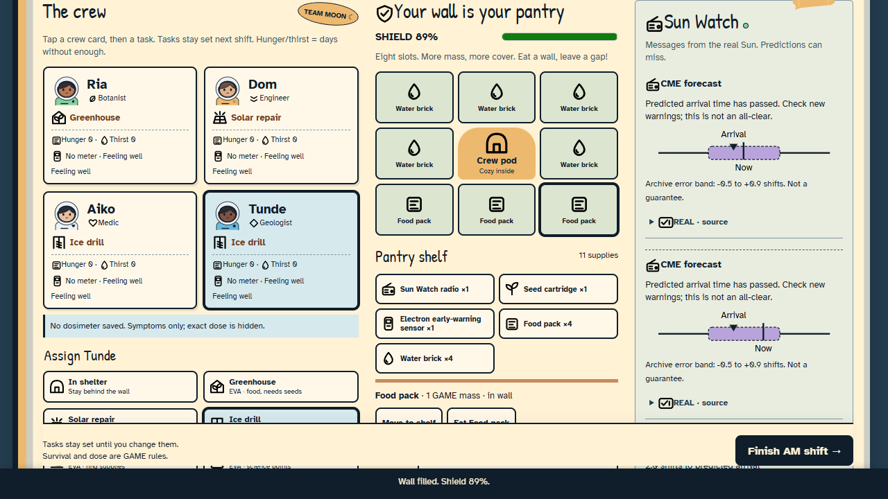
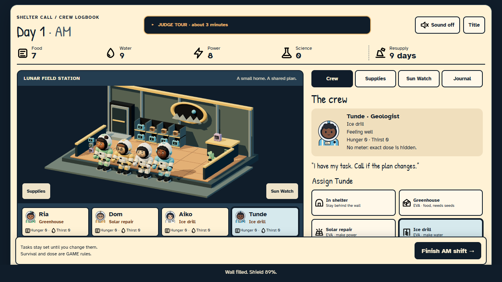
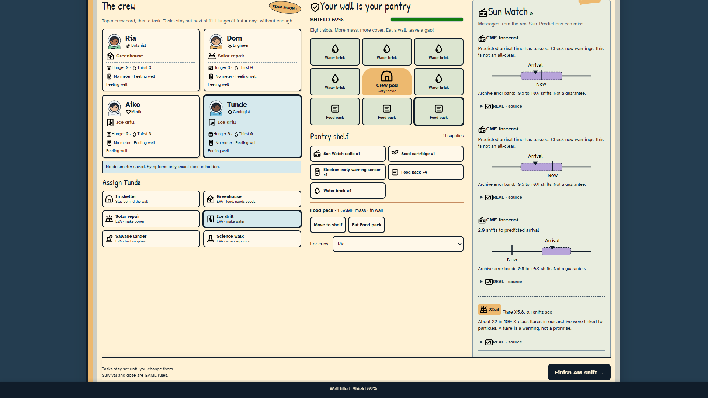
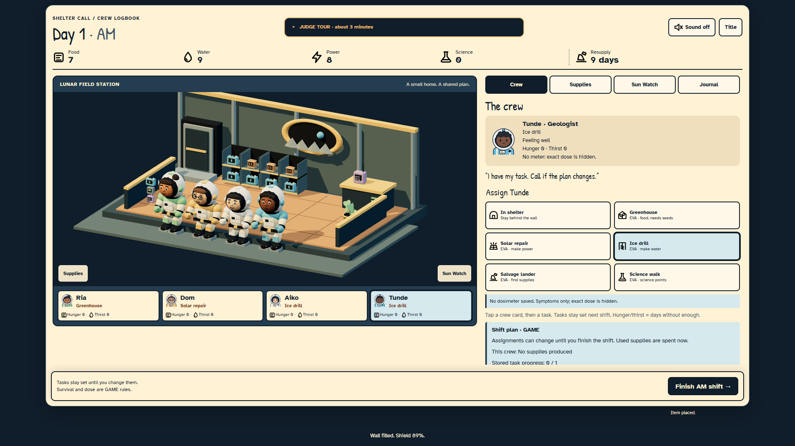
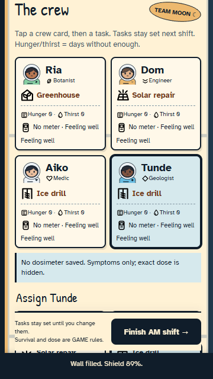
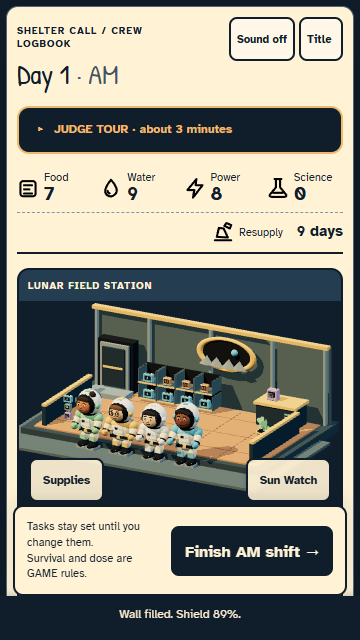
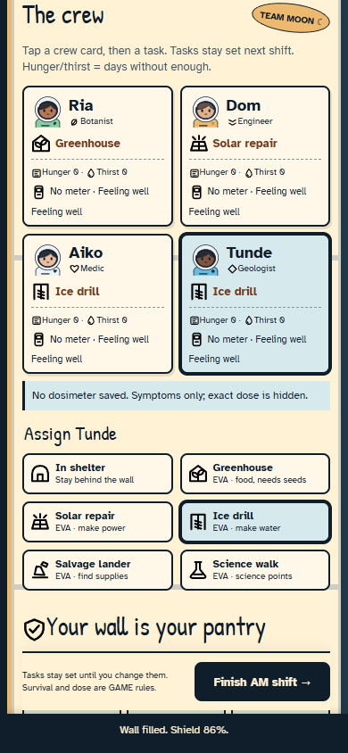
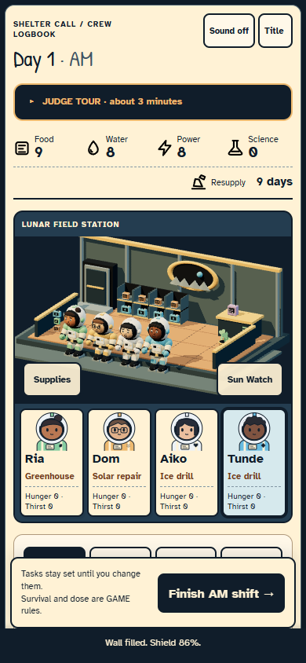

# Prompt 10 verification

The overhaul replaces the journal-only main view with an original living lunar cutaway, articulated crew, an illustrated fallback and one contextual inspector. Supply previews show exact immediate costs; production estimates remain conditional. The core simulation, archived NASA records, scoring and scramble physics are unchanged.

Baseline: `8237f366668ecfd9a93a4d4f52d29ea512f54377`. Main implementation: `ac22e342fbb76fadf818fc34ab99eead6e720843`. Work is committed directly to `main`; Cloudflare Pages deploys only after its validation job passes. Production verification is recorded below when complete.

## Same-state visual comparison

These shelter pairs use the same actual saved hatch checkpoint, seed `shelter-call-judge-2024`, crew, wall placement, assignments and UI scale. The after capture replays public actions rather than fabricating a winning state. `after/capture.json` records stable time/RNG and renderer metrics. Separate `after/fulljourney.json` records fresh real-control runs; their physically collected pickups can differ with timing.

| Viewport    | Before                                                            | After                                                           |
| ----------- | ----------------------------------------------------------------- | --------------------------------------------------------------- |
| 1280 × 720  |         |         |
| 1920 × 1080 |  |  |
| 360 × 640   |            |            |
| 390 × 844   |       |       |

Direct inspection covered room/crew/supply slots at all four sizes, full crew and wall panels, forecast, title/draft/settings, translated large text, illustrated fallback, 200%-equivalent reflow, and gallery crew under neutral/game lighting. Inspection caught obscured wall contents, excess draw calls, low-priority help above task buttons, untranslated dynamic shift labels and a large-text status/footer overlap; these were corrected. Menu captures wait for transitions to finish. Long source lists are retained as accessible text rather than compressed into a graphic.

- [Illustrated shelter](overhaul/after/illustrated.png), [Filipino largest text](overhaul/after/filipino-large.png), [640 × 360 reflow](overhaul/after/zoom-200.png).
- [Neutral crew](overhaul/after/gallery/crew-neutral.png), [working crew](overhaul/after/gallery/crew-game.png), [station models](overhaul/after/gallery/station-hatch.png), [gallery diagnostics](overhaul/after/gallery/models.json).
- [Title](overhaul/after/menu/title-360.png), [draft](overhaul/after/menu/draft-360.png), [translated settings](overhaul/after/menu/settings-fil-large-360.png).
- [Before recording](overhaul/before/gameplay.webm), [after recording](overhaul/after/gameplay.webm): actual browser input, no edited animation. The after clip lasts 25.015 seconds, physically saves radio/Ria, then reaches the kind Early Ride Home ending after four shifts. It is a short demonstration, not a successful full-supply rescue or human pacing study.

## Automated and gameplay evidence

| Check                         | Result                                                                                                                                                                                                              |
| ----------------------------- | ------------------------------------------------------------------------------------------------------------------------------------------------------------------------------------------------------------------- |
| Baseline browser suite        | 50 passed, 8.8 minutes                                                                                                                                                                                              |
| Unit/core coverage            | 95 tests passed; statements 99.71%, branches 99.08%, functions 100%, lines 99.83%                                                                                                                                   |
| NASA pipeline regression      | 23 tests passed; archived records unchanged                                                                                                                                                                         |
| Renderer/timed routes         | 18 passed, 4.7 minutes; three actual seeded routes on desktop/touch emulation, capacity/deposit/rescue, context loss, automatic fallback and disposal                                                               |
| Final shelter/overhaul checks | 20 passed, 1.3 minutes; wall preview versus use, pending warnings/reload, keyboard, blind equipment states, classroom pauses, offline entry and translated large text                                               |
| Fixed-state engine comparison | 100 committed actions across recall/keep-working policies match the baseline engine exactly, including every state, RNG, detached shift view and final Reveal; new previews run before each action without mutation |
| Four complete capture routes  | Each saves four crew, displays five forecasts, resolves eight shifts and reaches Early Ride Home; no browser errors/warnings                                                                                        |
| Gallery                       | All 29 models load; neutral/game lighting and articulated work pose recorded; no browser errors                                                                                                                     |
| Local lint/format/art/build   | Passed; budgets unchanged                                                                                                                                                                                           |

[Exact parity transcript](overhaul/parity.json), [full routes](overhaul/after/fulljourney.json), [same-state renderer captures](overhaul/after/capture.json), [video record](overhaul/after/video.json).

The existing full browser suite exercises complete Cadet, Commander and Flight Director missions, all replay modes, tutorial, Live snapshots, offline reload, translated controls and ending/source displays. CI result and production checks are recorded in the release section below. Tests are automated walkthroughs, not child playtesting.

A broader intermediate run passed 48 and failed six scramble checks at 419, then 221 draw calls. Art was batched by joint/finish using linear vertex colors. The unchanged 220-call limit then passed. An earlier shadow constant was removed in installed Three.js; PCF shadow mode fixed the warning. Failed/interrupted runs are not counted as successful gates.

## Measured performance

Environment: Windows, Chrome 154.0.8037.99 headless, NVIDIA RTX 4050 Laptop GPU through ANGLE/D3D11, 12 logical processors, device pixel ratio 1. The game caps DPR at 1.5; low graphics caps it at 1. Desktop and phone-sized contexts use the same laptop GPU.

| Measurement                    | Result / scope                                                                                                                          |
| ------------------------------ | --------------------------------------------------------------------------------------------------------------------------------------- |
| Local Lighthouse 13.5          | Performance 95, accessibility 100, best practices 100, SEO 100                                                                          |
| Simulated mobile 4G            | Interactive/LCP 2,719.63 ms; total blocking 50 ms; RTT 150 ms, throughput 1,638.4 kbps, CPU slowdown 4×                                 |
| In-game high/low frame samples | About 180 fps, median 5.5–5.6 ms, p95 about 5.7 ms; eight short 180-frame samples across two scenes, two widths and two quality choices |
| High shelter                   | 84 draws including shadows; 46,216–52,744 rendered triangles depending on supplies; 42 geometries                                       |
| Low shelter                    | 42 draws, 23,108 rendered triangles in the profiling state                                                                              |
| High scramble                  | 110 desktop / 111 phone draws; 155,508 rendered triangles including shadows                                                             |
| Low scramble                   | 59 / 60 draws; 79,504 rendered triangles                                                                                                |
| Original art kit               | 2,764,404 bytes before manifest; all individual indexed models below 6,000 triangles; minimum audited palette contrast 5.61:1           |
| Offline precache               | 171 entries, about 4.17 MiB; lazy scenes/assets/fonts included, `/api/*` excluded                                                       |

[Raw frame/GPU measurements](overhaul/performance.json), [local Lighthouse summary](overhaul/lighthouse-local.json). These short, refresh-limited laptop samples satisfy the desktop target for the observed states; they do not establish sustained mid-range Android performance. Lighthouse measures loading, not gameplay frame rate. No post-processing stack or runtime decoder was introduced.

## Reproduction

```sh
npm ci
npm run lint
npm run format:check
npm run test:coverage
python -m pytest data-pipeline/tests -q
npm run art:check
npm run build
npm run e2e
npm run preview -- --host 127.0.0.1 --port 4173 --strictPort
node tools/verify-overhaul-parity.mjs
node tools/capture-overhaul.mjs http://127.0.0.1:4173
node tools/capture-overhaul-menus.mjs http://127.0.0.1:4173
node tools/profile-scenes.mjs http://127.0.0.1:4173
node tools/performance.mjs http://127.0.0.1:4173 playwright-report/prompt10-lighthouse
```

For full route captures, run `tools/capture-submission.mjs` with an explicit output directory and `1280x720,1920x1080,360x640,390x844`. Run full routes before same-state captures when sharing a directory; preserve the route JSON as `fulljourney.json`. `tools/record-gameplay.mjs` records actual browser input. No engine parameters, ordering, RNG, score or capacity changed, so the existing balance simulation was not retuned or rerun; exact baseline transcript parity is the presentation-only regression proof.

## Limits

- Physical mid-range Android 30 fps, thermal behavior, real in-app browsers, installation and speaker quality remain unverified. The optional existing APK is the older Prompt 9 artifact; this overhaul ships to the web.
- 200% layout was checked through a 640 × 360 effective viewport for a 1280px screen. Browser-chrome zoom on a physical device is not claimed.
- Human ages 10–14 learnability, decision timing, long-session pacing and native-reader Filipino review remain unverified.
- The entered Space Apps challenge/year and team metadata are absent. Eligibility and challenge-specific form claims remain pending those facts.
- Official reference screenshots/descriptions were inspected. Linked YouTube footage was inaccessible, so no video-timing or commercial-engine implementation claims are made.

## Release verification

Final CI and production checks are in progress. Play at [Cloudflare Pages](https://shelter-call.pages.dev/) after the release result is recorded here; [judge mode](https://shelter-call.pages.dev/?judge=1) follows the real mission path.
